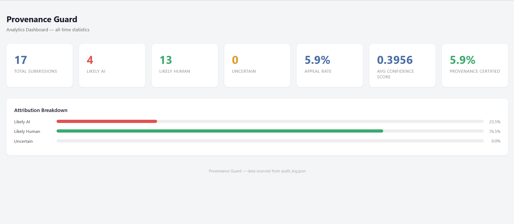

# Provenance Guard

A content attribution API that detects whether a piece of writing was authored
by a human or generated by AI. Built with Flask, Groq (LLaMA 3.3 70B), and
stylometric heuristics.

---

## Architecture Overview

A submitted piece of text travels through the following path:

1. **POST /submit** receives the text and a creator_id
2. **Signal 1 (Groq LLM)** sends the text to LLaMA 3.3 70B and receives an
   ai_probability score (0.0–1.0)
3. **Signal 2 (Stylometrics)** computes three structural metrics — sentence
   length variance, type-token ratio, and punctuation density — and combines
   them into a single score (0.0–1.0)
4. **Signal 3 (Filler Phrases)** detects AI-characteristic transitional phrases
   and normalizes their density into a score (0.0–1.0)
5. **Confidence scorer** combines all three signals into a weighted score:
   `confidence = (llm_score × 0.5) + (stylo_score × 0.3) + (filler_score × 0.2)`
6. **Label generator** maps the confidence score to a plain-language
   transparency label
7. **Audit log** writes a structured entry with all scores, attribution,
   and status
8. **JSON response** is returned to the caller with content_id, attribution,
   confidence, label, and all three signal scores

If a creator disputes the result:
1. **POST /appeal** receives content_id and creator_reasoning
2. The entry's status updates to "under_review"
3. The reasoning and appeal timestamp are appended to the log entry
4. A confirmation is returned

---

## Detection Signals

### Signal 1 — Groq LLM Classification (weight: 50%)
**What it measures:** Whether the text reads as AI or human holistically —
tone, phrasing patterns, semantic coherence, and stylistic consistency.
The model is prompted to return a structured JSON score between 0.0 and 1.0.

**Why I chose it:** LLM-based classification captures meaning and style
simultaneously in a way no heuristic can. It's the strongest single signal
available without training a custom model.

**What it misses:** Casual AI-generated text that mimics informal human speech
can fool it. It also has no memory of what "typical" human writing looks like
across a corpus — it reasons from general knowledge only.

### Signal 2 — Stylometric Heuristics (weight: 30%)
**What it measures:** Three structural/statistical properties:
- **Sentence length variance:** AI text tends toward uniform sentence lengths;
  human text is more irregular
- **Type-token ratio (TTR):** Vocabulary diversity — human writers reuse words
  less predictably than AI
- **Punctuation density:** Human writing uses more varied punctuation (dashes,
  parentheses, semicolons); AI text tends toward cleaner, sparser punctuation

**Why I chose it:** Stylometrics are completely independent from the LLM signal —
one is semantic, one is structural. Combining them is more informative than
either alone.

**What it misses:** Formal human writing (academic papers, legal documents)
appears structurally uniform and may score as AI-like. Non-native English
speakers who write carefully may also score higher than expected.

### Signal 3 — Filler Phrase Detection (weight: 20%)
**What it measures:** The density of AI-characteristic transitional and filler
phrases such as "it is important to note", "furthermore", "in conclusion",
"delve into", and "plays a crucial role". AI writing uses these phrases far
more predictably than human writing.

**Why I chose it:** Completely independent from both other signals — one is
semantic, one is structural, this one is lexical pattern matching. Each signal
captures a genuinely different property of the text.

**What it misses:** Human writers who have absorbed formal writing conventions
may use these phrases naturally. Academic writers in particular may trigger
false positives on this signal.

---

## Confidence Scoring

Signals are combined with a weighted average:
confidence = (llm_score × 0.5) + (stylo_score × 0.3) + (filler_score × 0.2)

The LLM signal receives the highest weight because semantic analysis is harder
to fool than structural or lexical metrics. Stylometrics get the second highest
weight as a strong structural check. Filler phrases get the lowest weight
because they can occasionally misfire on formal human writing.

### Score thresholds

| Confidence Range | Attribution  |
|------------------|--------------|
| 0.00 – 0.35      | likely_human |
| 0.36 – 0.64      | uncertain    |
| 0.65 – 1.00      | likely_ai    |

The uncertain band is deliberately wide. A false positive — labeling a human's
work as AI-generated — is the worse error on a writing platform. The system
requires a confidence of 0.65 before calling something AI, not just 0.5.

### Example submissions with different confidence scores

**High-confidence AI text (confidence: 0.7351)**
Text: "Artificial intelligence represents a transformative paradigm shift in

modern society. It is important to note that while the benefits are numerous,

stakeholders must collaborate to ensure responsible deployment. Furthermore,

it is crucial to consider the ethical implications."
llm_score: 0.80 | stylo_score: 0.4505 | filler_score: 1.0 | confidence: 0.7351

attribution: likely_ai

**High-confidence human text (confidence: 0.1659)**
Text: "ok so i finally tried that new ramen place downtown and honestly?

underwhelming. the broth was fine but they put WAY too much sodium in it

and i was thirsty for like three hours after."
llm_score: 0.10 | stylo_score: 0.3865 | filler_score: 0.0 | confidence: 0.1659

attribution: likely_human

---

## Transparency Label Variants

The label shown to a reader changes based on the confidence score.
All variants are reachable through different inputs.

### High-confidence AI (confidence ≥ 0.75)
> **AI-Generated Content**
> Our analysis strongly suggests this piece was AI-generated (confidence: XX%).
> If you are the creator and believe this is incorrect, you can submit an appeal.

### Likely AI but not certain (confidence 0.65–0.74)
> **Likely AI-Generated**
> Our analysis suggests this piece may be AI-generated, though we are not
> certain (confidence: XX%). If you are the creator and believe this is
> incorrect, you can submit an appeal.

### Uncertain (confidence 0.36–0.64)
> **Attribution Uncertain**
> We were unable to confidently determine whether this piece was written by a
> human or generated by AI (confidence: XX%). The author has not been flagged
> and this content remains fully visible. Creators may submit an appeal to
> provide additional context.

### Likely human (confidence 0.26–0.35)
> **Likely Human-Written**
> Our analysis suggests this piece was probably written by a human
> (confidence: XX%).

### High-confidence human (confidence ≤ 0.25)
> **Human-Written Content**
> Our analysis strongly suggests this piece was written by a human
> (confidence: XX%).

---

## Appeals Workflow

Any creator can contest a classification by submitting a POST /appeal request
with their content_id and a plain-language explanation.

**What the system does:**
- Looks up the content_id in the audit log
- Updates the status from "classified" to "under_review"
- Appends the creator_reasoning and an appeal_timestamp to the log entry
- Returns a confirmation

**What a human reviewer sees:**
The full audit log entry — original llm_score, stylo_score, filler_score,
confidence, attribution, timestamp, and the creator's reasoning side by side.

Automated re-classification is not implemented. Appeals are reviewed by humans.

---

## Rate Limiting

The POST /submit endpoint is limited to:
- **10 requests per minute**
- **100 requests per day**

**Reasoning:** A real writer submitting their own work would rarely submit more
than a few pieces per session. 10 per minute is generous for legitimate use
while preventing a script from flooding the system. The 100/day cap prevents
sustained automated abuse across a full day. A 429 response is returned when
either limit is exceeded.

**Evidence — rate limit test output (12 rapid requests):**
200

200

200

200

200

200

200

200

200

200

429 Too Many Requests

429 Too Many Requests

---

## Audit Log

Every attribution decision is written to `audit_log.json`. Each entry captures:
- `content_id` — unique ID for the submission
- `creator_id` — who submitted it
- `timestamp` — UTC ISO 8601
- `attribution` — likely_ai / likely_human / uncertain
- `confidence` — combined weighted score
- `llm_score` — Signal 1 output
- `stylo_score` — Signal 2 output
- `filler_score` — Signal 3 output
- `status` — classified / under_review
- `appeal_reasoning` — populated if an appeal was filed
- `appeal_timestamp` — when the appeal was submitted
- `provenance_certificate` — populated if a certificate was issued

Sample entries are visible via GET /log. Example output:

```json
{
  "entries": [
    {
      "appeal_reasoning": null,
      "attribution": "likely_ai",
      "confidence": 0.7351,
      "content_id": "fea4f9e2-fcda-421c-a8e1-bac9ab1c3b2c",
      "creator_id": "test-user-1",
      "filler_score": 1.0,
      "llm_score": 0.8,
      "provenance_certificate": null,
      "status": "classified",
      "stylo_score": 0.4505,
      "timestamp": "2026-06-25T14:30:00.000000+00:00"
    },
    {
      "appeal_reasoning": null,
      "attribution": "likely_human",
      "confidence": 0.1659,
      "content_id": "f25f7a1e-de00-4fb0-877c-bb45cf2bf0b8",
      "creator_id": "test-user-2",
      "filler_score": 0.0,
      "llm_score": 0.1,
      "provenance_certificate": {
        "badge": "✓ Verified Human-Written",
        "certified": true,
        "issued_at": "2026-06-25T14:37:24.612343+00:00",
        "verification_statement": "I wrote this from my own personal experience."
      },
      "status": "classified",
      "stylo_score": 0.3865,
      "timestamp": "2026-06-25T14:31:00.000000+00:00"
    },
    {
      "appeal_reasoning": "I wrote this myself. I am a non-native English speaker and my writing style may appear more formal than typical.",
      "appeal_timestamp": "2026-06-25T14:13:50.780085+00:00",
      "attribution": "likely_ai",
      "confidence": 0.7351,
      "content_id": "eb621a9d-114b-44df-9db0-7bddbb1f5917",
      "creator_id": "test-user-1",
      "filler_score": 1.0,
      "llm_score": 0.8,
      "provenance_certificate": null,
      "status": "under_review",
      "stylo_score": 0.4505,
      "timestamp": "2026-06-25T14:11:05.921050+00:00"
    }
  ]
}
```

---

## Stretch Features

### Ensemble Detection (3 Signals)

Added a third signal — filler phrase detection — to the detection pipeline.

**What it measures:** The density of AI-characteristic transitional and filler
phrases such as "it is important to note", "furthermore", "in conclusion",
"delve into", and "plays a crucial role". AI writing uses these phrases far
more predictably than human writing.

**Output:** A float from 0.0 (human) to 1.0 (AI), normalized by word count.

**Updated weighting:**
| Signal | Weight |
|--------|--------|
| LLM (Groq) | 50% |
| Stylometrics | 30% |
| Filler phrases | 20% |

**Example — AI text with filler phrases:**
filler_score: 1.0 | llm_score: 0.80 | stylo_score: 0.45 | confidence: 0.7351

**Example — Human text with no filler phrases:**
filler_score: 0.0 | llm_score: 0.10 | stylo_score: 0.39 | confidence: 0.1659

---

### Provenance Certificate

Creators can earn a "Verified Human-Written" badge on their content by
submitting a POST /verify request with their content_id and a
verification_statement explaining their authorship.

**How it works:**
- Only available for content attributed as `likely_human` or `uncertain`
- `likely_ai` content is blocked with a 403 — the creator must appeal first
- The certificate is stored in the audit log entry and returned in the response
- The badge reads: **✓ Verified Human-Written**

**Endpoint:** `POST /verify`
```json
{
  "content_id": "your-content-id",
  "verification_statement": "I wrote this from personal experience."
}
```

**Response:**
```json
{
  "badge": "✓ Verified Human-Written",
  "issued_at": "2026-06-25T14:37:24.612343+00:00",
  "message": "Your provenance certificate has been issued and attached to this content."
}
```

---

### Analytics Dashboard

A visual dashboard available at `GET /dashboard` showing all-time detection
statistics drawn live from the audit log.

**Metrics displayed:**
- Total submissions
- Likely AI / Likely Human / Uncertain counts
- Appeal rate (% of submissions that received an appeal)
- Average confidence score across all submissions
- Provenance certificate rate (% of submissions that earned a certificate)
- Attribution breakdown as a visual bar chart

**How to view:** Run the server and open `http://localhost:5000/dashboard`
in your browser.

**Dashboard preview:**



---

## Known Limitations

**Formal human writing scores as AI-like.** Academic essays, legal briefs, and
professional reports have low sentence length variance and dense vocabulary
reuse — the same structural properties the stylometrics signal uses to identify
AI text. A law student submitting a brief would likely score in the uncertain
or likely_ai range despite writing it themselves. The appeal workflow is the
primary safety net for this case.

**Very short texts are unreliable.** Stylometric signals need enough data to
be meaningful. A haiku or single sentence doesn't produce reliable sentence
length variance or type-token ratio. The system returns 0.5 (uncertain) for
texts with fewer than two sentences, but this is a blunt instrument.

---

## Spec Reflection

**One way the spec helped:** Writing out the three label variants in planning.md
before touching any code forced a concrete decision about what 0.5 means to a
user. That decision — that uncertain should never tip toward AI by default —
shaped the threshold design (0.65 cutoff instead of 0.5) and the label text
before a single line of code existed.

**One way implementation diverged:** The planning.md specified three label
variants (high-confidence AI, uncertain, high-confidence human). During
implementation it became clear that a score of 0.67 and a score of 0.90 both
hit "likely_ai" but feel very different — one is borderline, one is definitive.
The final implementation uses five label variants instead of three, splitting
both the AI and human ends into high-confidence and moderate bands.

---

## AI Usage

**Instance 1 — Flask app skeleton and Signal 1:**
I provided the architecture diagram and detection signals section from
planning.md and asked for a Flask app skeleton with a POST /submit route and
a Groq signal function. The AI generated a working skeleton but the label
generation was a single hardcoded string regardless of confidence score.
I revised it to implement five distinct label variants mapped to confidence
ranges, matching the spec I had written.

**Instance 2 — Stylometrics function:**
I provided the detection signals section and asked for a stylometric heuristics
function computing sentence length variance, type-token ratio, and punctuation
density. The AI produced a working function but combined the three metrics with
equal weights and no normalization bounds, meaning scores could exceed 1.0 on
extreme inputs. I added explicit clamping with max(0.0, min(1.0, ...)) on each
metric and tested the function on four inputs before wiring it into the endpoint.